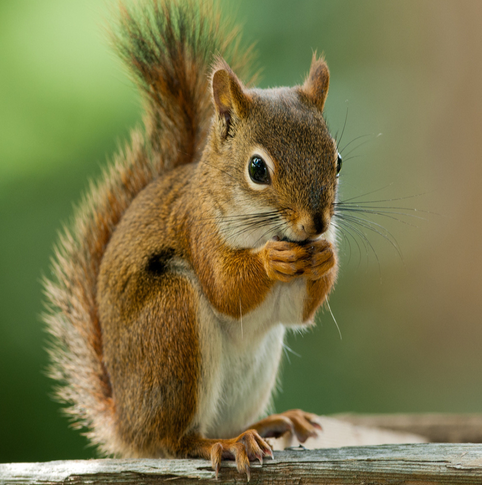
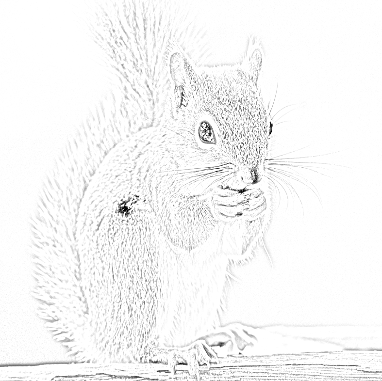
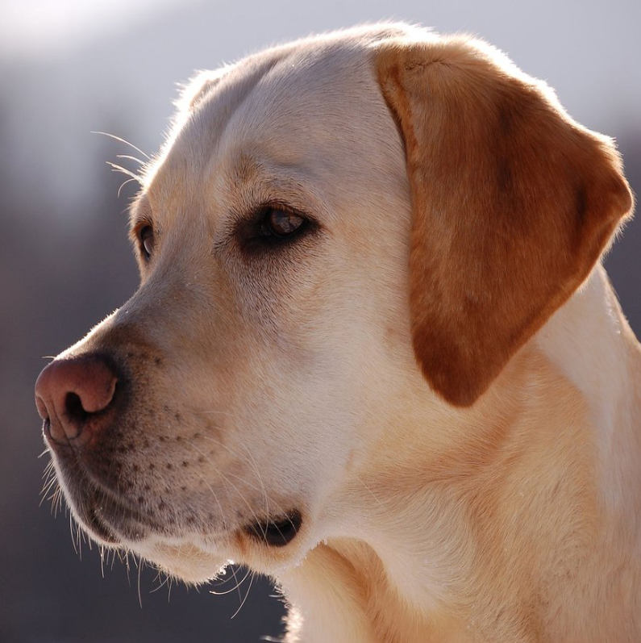
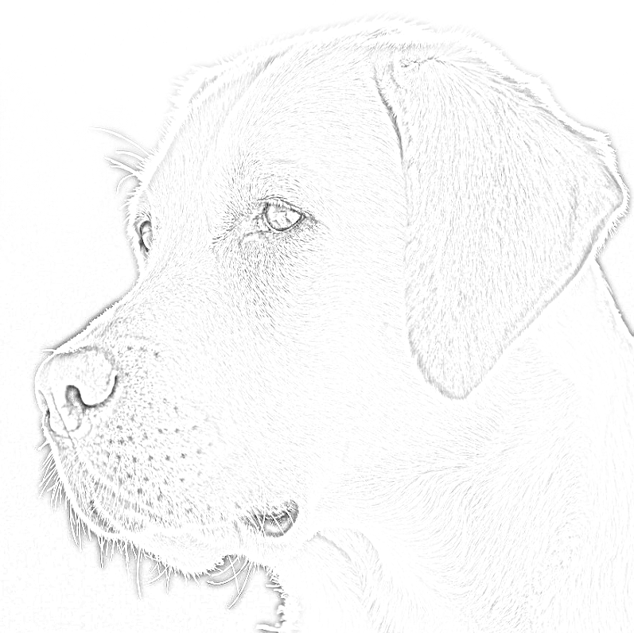

# Image To Pencil Sketch 
## Beginner Project with  Python

### Description 

A Simple Project with Python that converts an Image to into Pencil Drawing / Sketch .

The animals that are available as an image are : 
- Dog 
- Cat 
- Horse
- Monkey
- Fox
- Lion
- Squirrel
- Rabbit

##### You can see and modify the images in <strong> " / assets " </strong> folder. 

### Features 

Using multiple method such as _imread()_ to read an image, _cvtColor()_ to convert colors , and _GaussianBlur()_ to add a gaussian blur to the colors , etc. from the module "opencv-python.py" to modify and interact with images and assets.

Basic knowledge of Python fundamental concepts (Functions, Loops, lists, tuples ,...)

### Requirements 

Having Python 3.x installed in computer with basic modules. <a href = 'https://www.python.org/downloads/'> Click here </a> to download Python.

Install module "opencv" after installing Python by typing this command : 

~~~~sh 
pip install opencv-python
~~~~

### Execution Samples 

#### Sample #1 : 

~~~~~sh 
Select your Animal and we will make a pencil Sketch of It.
-  dog
-  cat
-  horse
-  monkey
-  fox
-  lion
-  squirrel
-  rabbit
What animal did you choose ?   squirrel # User Input

Process finished with exit code 0
~~~~~

Output : 

#### Sample #2 : 

~~~~~sh 
Select your Animal and we will make a pencil Sketch of It.
-  dog
-  cat
-  horse
-  monkey
-  fox
-  lion
-  squirrel
-  rabbit
What animal did you choose ?   cat # User Input

Process finished with exit code 0
~~~~~

Output : 

